<!-- ══════════════════════════════════════════════════════════════════════════════ -->
<!-- KARTHIK VANAPALLI — GITHUB PROFILE README                                   -->
<!-- Machine Learning Engineer · Computer Vision · Robotics · AI Engineering     -->
<!-- ══════════════════════════════════════════════════════════════════════════════ -->

<!-- HERO BANNER -->
<div align="center">
  
</div>

<!-- TYPING ANIMATION -->
<div align="center">
  <br>
  <a href="https://git.io/typing-svg">
    
  </a>
</div>

<!-- SOCIAL BADGES -->
<div align="center">
  <br>
  <a href="https://www.linkedin.com/in/karthik-vanapalli"></a>&nbsp;
  <a href="https://karthikvanapalli.vercel.app"></a>&nbsp;
  <a href="mailto:karthikvanapalli08@gmail.com"></a>
</div>

<!-- VISITOR COUNTER -->
<div align="center">
  <br>
  
</div>

<br>

<!-- ══════════════════════════════════════════════════════════════════════════════ -->
<!-- IMPACT AT A GLANCE                                                           -->
<!-- ══════════════════════════════════════════════════════════════════════════════ -->

<div align="center">
  
</div>

<h2 align="center">⚡ Impact at a Glance</h2>

<div align="center">
<table>
<tr>
<td align="center" width="280">

💼 **ML Engineer Intern**
<br>Cosmediq

</td>
<td align="center" width="280">

🚀 **5+ Production AI Projects**
<br>Computer Vision · Robotics · AI

</td>
<td align="center" width="280">

📊 **16,653 Images Processed**
<br>Medical Dataset Engineering

</td>
</tr>
<tr>
<td align="center">

🎯 **69.4% mAP@50**
<br>Medical AI Model

</td>
<td align="center">

⚡ **108.6 FPS Inference**
<br>CUDA / TensorRT

</td>
<td align="center">

🤖 **8 ROS2 Nodes**
<br>Autonomous Navigation

</td>
</tr>
</table>
</div>

<br>

<!-- ══════════════════════════════════════════════════════════════════════════════ -->
<!-- ENGINEERING PHILOSOPHY                                                       -->
<!-- ══════════════════════════════════════════════════════════════════════════════ -->

## 💡 Engineering Philosophy

> *I believe intelligent systems are built by combining reliable data, scalable software engineering, and continuous experimentation. My projects focus on solving practical problems by taking ideas from research into production-oriented implementations across Computer Vision, Robotics, and modern AI.*

<br>

<!-- ══════════════════════════════════════════════════════════════════════════════ -->
<!-- ABOUT ME                                                                     -->
<!-- ══════════════════════════════════════════════════════════════════════════════ -->

## 🧑‍💻 About Me

I am a Computer Science undergraduate specializing in Artificial Intelligence and Machine Learning with a passion for building intelligent software systems that solve real-world problems. My interests span Machine Learning, Computer Vision, Data Engineering, Robotics, and modern AI systems, with a strong focus on developing scalable and production-ready solutions.

I enjoy turning ideas into working systems by combining software engineering with artificial intelligence. Whether it's training computer vision models, engineering reliable datasets, optimizing inference pipelines, or building autonomous systems, I enjoy understanding how things work and continuously improving them. I am currently exploring Large Language Models, AI Agents, and production AI infrastructure while building projects that strengthen my engineering skills.

```python
class KarthikVanapalli:
    role      = "Machine Learning Engineer Intern @ Cosmediq"
    education = "B.Tech CSE (AI & ML) @ SRM IST | CGPA: 8.88/10"
    languages = ["Python", "C++", "C", "SQL"]
    interests = ["Computer Vision", "Robotics", "LLMs", "AI Agents"]
    currently = "AI Chat Assistant, Computer Vision Systems & LLM Applications"
    fun_fact  = "Every major project I build teaches me an entirely new technology stack"
```

<br>

<!-- ══════════════════════════════════════════════════════════════════════════════ -->
<!-- CURRENT FOCUS                                                                -->
<!-- ══════════════════════════════════════════════════════════════════════════════ -->

## 🔭 Current Focus

**Currently Building**
- Production-grade AI Chat Assistant with multi-LLM support, AI agents, and MCP integration
- Optimizing QYRO clinical acne detection system beyond 75% mAP@50
- Expanding the QYRO Dataset Engineering Pipeline for larger multi-source medical datasets

**Currently Researching**
- Medical AI &nbsp;·&nbsp; Vision-Language Models &nbsp;·&nbsp; Agentic AI Systems &nbsp;·&nbsp; Production AI Infrastructure

**Currently Exploring**
- Large Language Models (LLMs) &nbsp;·&nbsp; Retrieval-Augmented Generation (RAG) &nbsp;·&nbsp; AI Agents
- Model Context Protocol (MCP) &nbsp;·&nbsp; LangGraph &nbsp;·&nbsp; Advanced CUDA Optimization

**Roadmap**
- Enterprise RAG Platform &nbsp;·&nbsp; AI SOC Security Agent &nbsp;·&nbsp; Autonomous Robotics with RL
- Vision-Language Medical Assistant &nbsp;·&nbsp; Multi-Agent AI Workspace

<br>

<!-- ══════════════════════════════════════════════════════════════════════════════ -->
<!-- TECHNICAL SKILLS                                                             -->
<!-- ══════════════════════════════════════════════════════════════════════════════ -->

<div align="center">
  
</div>

## 🛠 Technical Skills

<table>
<tr>
<td align="center" width="140"><b>Languages</b></td>
<td>


</td>
</tr>
<tr>
<td align="center"><b>Frameworks</b></td>
<td>


</td>
</tr>
<tr>
<td align="center"><b>AI / CV</b></td>
<td>


</td>
</tr>
<tr>
<td align="center"><b>Robotics</b></td>
<td>


</td>
</tr>
<tr>
<td align="center"><b>Cloud</b></td>
<td>


</td>
</tr>
<tr>
<td align="center"><b>Databases</b></td>
<td>


</td>
</tr>
<tr>
<td align="center"><b>Tools</b></td>
<td>


</td>
</tr>
</table>

<br>

<!-- ══════════════════════════════════════════════════════════════════════════════ -->
<!-- FEATURED PROJECTS                                                            -->
<!-- ══════════════════════════════════════════════════════════════════════════════ -->

<div align="center">
  
</div>

## 🚀 Featured Projects

<!-- ─────────── PROJECT 1: ATOS ─────────── -->

<details>
<summary>
<h3>🔵 AI Traffic Intelligence System (ATOS v3.1) &nbsp; </h3>
<blockquote>Production-oriented real-time traffic intelligence platform with GPU-accelerated vehicle detection, adaptive signal optimization, and telemetry streaming.</blockquote>
</summary>

<br>

**Key Metrics**

| Metric | Value |
|:---|:---|
| **Inference Speed** | 108.6 FPS |
| **End-to-End Latency** | 6.62 ms |
| **Detection Accuracy** | 92.4% mAP@50 |
| **GPU Memory Usage** | 1.1 GB |
| **Traffic Queue Reduction** | 24% |

**Architecture Highlights**
- Integrated TensorRT-optimized YOLOv8 with CUDA pinned memory and fused GPU preprocessing kernels
- Asynchronous CUDA streams with FP16 TensorRT optimization and UDP-based telemetry
- Modular edge AI framework: custom CUDA kernels, TensorRT inference, C++ analytics engines
- SQLite-backed telemetry logging with adaptive traffic signal optimization

**Tech Stack**


<br>

<a href="https://github.com/Karthik2509-git/AI-Traffic-Intelligence-System"></a>

</details>

<!-- ─────────── PROJECT 2: QYRO CLINICAL ─────────── -->

<details>
<summary>
<h3>🟣 QYRO AI Clinical Decision Support System &nbsp; </h3>
<blockquote>AI-powered clinical decision support system for acne detection, subtype classification, and severity assessment through an end-to-end computer vision pipeline optimized for medical imaging.</blockquote>
</summary>

<br>

**Key Metrics**

| Metric | Value |
|:---|:---|
| **Detection Accuracy** | 69.4% mAP@50 |
| **Target Accuracy** | 75% mAP@50 |
| **Model Architecture** | YOLOv11 + EfficientNet |
| **Inference Runtime** | CUDA + TensorRT |

**Architecture Highlights**
- End-to-end computer vision pipeline: acne lesion detection → subtype classification → severity assessment
- Automated model evaluation and benchmarking workflows for reproducible model assessment
- Iterative experimentation with hyperparameter tuning across multiple model architectures
- Integration with public and proprietary dermatology datasets

**Tech Stack**


<br>


</details>

<!-- ─────────── PROJECT 3: QYRO PIPELINE ─────────── -->

<details>
<summary>
<h3>🟣 QYRO Dataset Engineering Pipeline &nbsp; </h3>
<blockquote>Reusable 12-stage dataset engineering framework that automates multi-source data ingestion, annotation harmonization, quality validation, and leakage-free dataset preparation for medical computer vision research.</blockquote>
</summary>

<br>

**Key Metrics**

| Metric | Value |
|:---|:---|
| **Images Processed** | 16,653 |
| **Source Datasets** | 5 public datasets |
| **Curated Images** | 835 |
| **Validated Annotations** | 5,561 bounding boxes |
| **Yield Rate** | 5.01% (quality-first) |

**Architecture Highlights**
- 12-stage automated pipeline: ingestion → deduplication (dHash/MD5) → quality scoring → annotation validation → partitioning
- YOLO-assisted annotation auditing with automated image quality assessment
- Leakage-free train/val/test splitting with strict verification tests
- Modular and extensible architecture supporting new datasets, validation policies, and quality modules

**Tech Stack**


<br>

<a href="https://github.com/Karthik2509-git/qyro-data-engineering-pipeline"></a>

</details>

<!-- ─────────── PROJECT 4: MERS ─────────── -->

<details>
<summary>
<h3>🟢 Multimodal Emotion Recognition System (MERS) &nbsp; </h3>
<blockquote>Privacy-preserving multimodal emotion recognition platform combining facial landmark analysis, speech processing, and deep learning for real-time offline emotion classification.</blockquote>
</summary>

<br>

**Key Metrics**

| Metric | Value |
|:---|:---|
| **Validation Accuracy** | 80.61% |
| **Inference Latency** | < 500 ms |
| **Cloud Dependency** | None (100% offline) |
| **Modalities** | Facial + Vocal |

**Architecture Highlights**
- Dual-modality late fusion: MediaPipe facial landmarks + Librosa vocal prosody analysis
- Confidence-weighted multimodal fusion with MFCC, Chroma, and Tonnetz feature engineering
- Hybrid Flutter–FastAPI client-server architecture with REST APIs and WebSocket streaming
- Explainable AI with human-readable feature attribution mapping
- Privacy-first: all processing in-memory, no persistent biometric storage

**Tech Stack**


<br>

<a href="https://github.com/Karthik2509-git/Multimodal-Emotion-Recognition-System"></a>

</details>

<!-- ─────────── PROJECT 5: AUTONOMOUS BUGGY ─────────── -->

<details>
<summary>
<h3>🟠 SRM Autonomous Electric Campus Buggy &nbsp; </h3>
<blockquote>Software-in-the-Loop autonomous navigation system using ROS2 and Gazebo with Dijkstra-based path planning, obstacle avoidance, and modular robotics architecture.</blockquote>
</summary>

<br>

**Key Metrics**

| Metric | Value |
|:---|:---|
| **ROS2 Nodes** | 8 interconnected |
| **Communication Topics** | 19 real-time |
| **Virtual Sensors** | 8 (LiDAR, Ultrasonic, IMU, GPS, Camera) |
| **LiDAR Safety Threshold** | 1.5 m |
| **Ultrasonic Threshold** | 0.30 m |

**Architecture Highlights**
- Dijkstra-based autonomous navigation with waypoint following and 7-state finite state machine
- LiDAR and ultrasonic-based perception with automatic stop–resume logic (5 consecutive clean scans)
- Modular ROS2 ecosystem with RViz2 visualization and one-command automated deployment
- Crowd detection, emergency braking, and adaptive speed control

**Tech Stack**


<br>

<a href="https://github.com/Karthik2509-git/srm-autonomous-buggy"></a>

</details>

<br>

<!-- ══════════════════════════════════════════════════════════════════════════════ -->
<!-- OTHER PROJECTS                                                               -->
<!-- ══════════════════════════════════════════════════════════════════════════════ -->

## 📦 Other Projects

| Project | Description | Tech |
|:---|:---|:---|
| 🔷 **AI Chat Assistant** | Modern AI workspace with premium Next.js frontend and FastAPI backend featuring SSE streaming, conversation management, and multi-model support | Next.js · FastAPI · SSE |
| ☁️ **Patient Vitals Monitoring** | Cloud-native healthcare monitoring platform with Vertex AI, Pub/Sub, Cloud Functions, and real-time Twilio alerting | GCP · Vertex AI · Pub/Sub |
| 🏛️ **Smart Panchayat System** | Web-based governance platform for digitizing village administration with complaint management and service workflows | Web · Dashboard · CRUD |
| ⚖️ **Vakeel Saab AI** | AI-powered legal assistant for legal information retrieval and AI-guided responses using NLP | NLP · AI · Hackathon |

<br>

<!-- ══════════════════════════════════════════════════════════════════════════════ -->
<!-- EXPERIENCE                                                                   -->
<!-- ══════════════════════════════════════════════════════════════════════════════ -->

<div align="center">
  
</div>

## 💼 Experience

<table>
<tr>
<td>

### Machine Learning Engineer Intern
**Cosmediq** &nbsp;·&nbsp; Jun 2026 – Present &nbsp;·&nbsp; Visakhapatnam

**Responsibilities**
- Develop and optimize deep learning models for acne lesion detection, subtype classification, and severity assessment
- Design automated evaluation pipelines, benchmark experiments, and improve dataset quality
- Curate and integrate public and proprietary dermatology datasets

**Achievements**
- Achieved **69.4% mAP@50** using YOLOv11 and EfficientNet-based computer vision models
- Built automated evaluation pipelines supporting reproducible benchmarking and deployment decisions
- Currently optimizing toward **75% mAP@50** production target

**Technologies**


</td>
</tr>
</table>

### 🎓 Education

**SRM Institute of Science and Technology** — Tiruchirapalli, Tamil Nadu
<br>B.Tech Computer Science and Engineering (Artificial Intelligence & Machine Learning) · CGPA: 8.88/10 · 2027

<br>

<!-- ══════════════════════════════════════════════════════════════════════════════ -->
<!-- CERTIFICATIONS                                                               -->
<!-- ══════════════════════════════════════════════════════════════════════════════ -->

## 📜 Certifications


-1A73E8?style=flat-square)


<br>

<!-- ══════════════════════════════════════════════════════════════════════════════ -->
<!-- ACHIEVEMENTS                                                                 -->
<!-- ══════════════════════════════════════════════════════════════════════════════ -->

## 🏆 Achievements

| | Achievement |
|:---|:---|
| 🏆 | **Finalist** — RoboSprint, IISc Bangalore |
| 🥇 | **HackerRank Gold** — Problem Solving (5★) |
| 🏗️ | **5+ Production AI Projects** — Computer Vision, Robotics, and LLM Applications |
| 💻 | **Active Contestant** — CodeChef Rated Competitions |

<br>

<!-- ══════════════════════════════════════════════════════════════════════════════ -->
<!-- CODING PROFILES                                                              -->
<!-- ══════════════════════════════════════════════════════════════════════════════ -->

## 💻 Coding Profiles

<div align="center">
  <a href="https://leetcode.com/u/Karthik_2510/"></a>&nbsp;
  <a href="https://www.hackerrank.com/profile/karthikvanapall3"></a>&nbsp;
  <a href="https://codolio.com/profile/KarthikVanapalli"></a>
</div>

<br>

<div align="center">
  
</div>

<br>

<!-- ══════════════════════════════════════════════════════════════════════════════ -->
<!-- GITHUB ANALYTICS                                                             -->
<!-- ══════════════════════════════════════════════════════════════════════════════ -->

<div align="center">
  
</div>

## 📊 GitHub Analytics

<!-- Stats + Streak (side by side) -->
<div align="center">
  
  &nbsp;
  
</div>

<br>

<!-- Languages + Activity Graph (side by side where possible) -->
<div align="center">
  
</div>

<br>

<!-- Activity Graph -->
<div align="center">
  
</div>

<br>

<!-- Contribution Snake -->
<div align="center">
  <picture>
    <source media="(prefers-color-scheme: dark)" srcset="https://raw.githubusercontent.com/Karthik2509-git/Karthik2509-git/output/github-snake-dark.svg" />
    <source media="(prefers-color-scheme: light)" srcset="https://raw.githubusercontent.com/Karthik2509-git/Karthik2509-git/output/github-snake.svg" />
    
  </picture>
</div>

<br>

<!-- ══════════════════════════════════════════════════════════════════════════════ -->
<!-- CONNECT                                                                      -->
<!-- ══════════════════════════════════════════════════════════════════════════════ -->

<div align="center">
  
</div>

<h2 align="center">Let's Build Something Amazing Together</h2>

<div align="center">
  <a href="https://karthikvanapalli.vercel.app"></a>&nbsp;
  <a href="https://www.linkedin.com/in/karthik-vanapalli"></a>&nbsp;
  <a href="mailto:karthikvanapalli08@gmail.com"></a>&nbsp;
  <a href="https://github.com/Karthik2509-git"></a>
</div>

<br>

<div align="center">
  <a href="https://leetcode.com/u/Karthik_2510/"></a>&nbsp;
  <a href="https://www.hackerrank.com/profile/karthikvanapall3"></a>&nbsp;
  <a href="https://codolio.com/profile/KarthikVanapalli"></a>
</div>

<br>

<!-- ══════════════════════════════════════════════════════════════════════════════ -->
<!-- FOOTER                                                                       -->
<!-- ══════════════════════════════════════════════════════════════════════════════ -->

<div align="center">
  
</div>

<div align="center">
  <br>
  <i>Thanks for visiting! ⭐ If you enjoy my work, consider exploring my repositories.</i>
  <br><br>
  
</div>
